# meet - Social Media App - MERN
## About


This project is an Instagram Clone.


## Development


### These were used in development :


#### Frontend 

@reduxjs/toolkit: 2.2.4

crypto-js: 4.2.0

jwt-decode: 4.0.0

react: 18.2.0

react-dom: 18.2.0

react-icons: 5.2.1

react-loader-spinner: 6.1.6

react-redux: 9.1.2

react-router-dom: 6.23.1

react-toastify: 10.0.5

timeago.js: 4.0.2

#### Backend

bcrypt: 5.1.1

body-parser: 1.20.2

cookie-parser: 1.4.6

cors: 2.8.5

ejs: 3.1.10

express: 4.19.2

jsonwebtoken: 9.0.2

mongoose: 8.3.4

multer: 1.4.5-lts.1

nodemon: 3.1.0

path: 0.12.7


#### Authentication

This app's authentication method is OAuth 2.0. If you login, you will get two tokens that called access and refresh. If your access token expired, your access token will be refreshed with refresh token. Also your access token is encrypted with AES - 256 algorithm.


### Gallery


# Desktop View

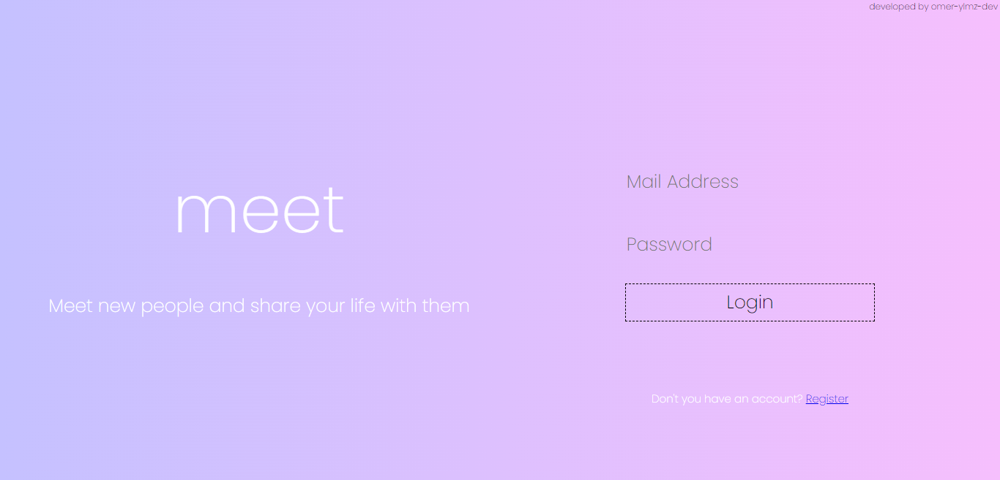

#
#

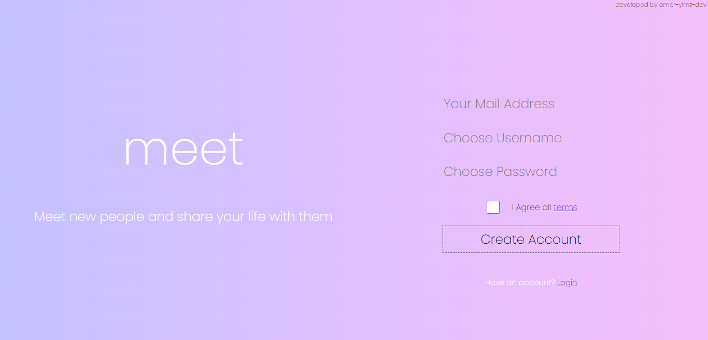

#
#

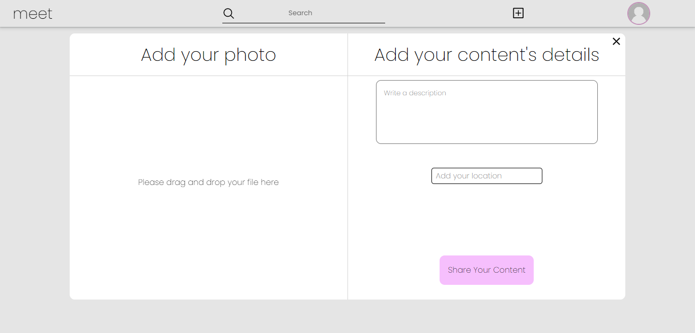

#
#

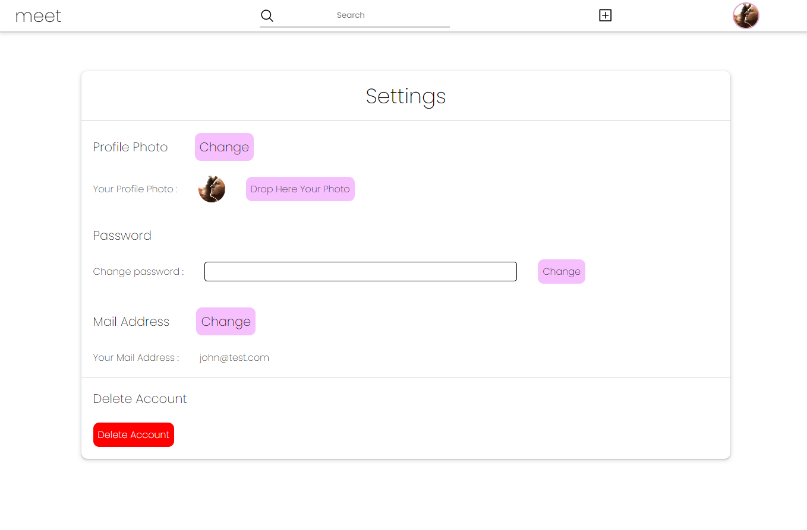

#
#

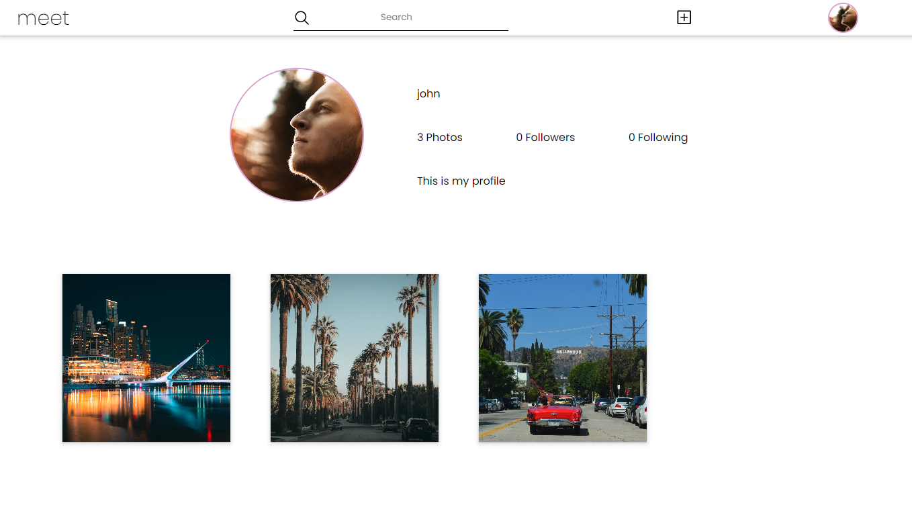

#
#

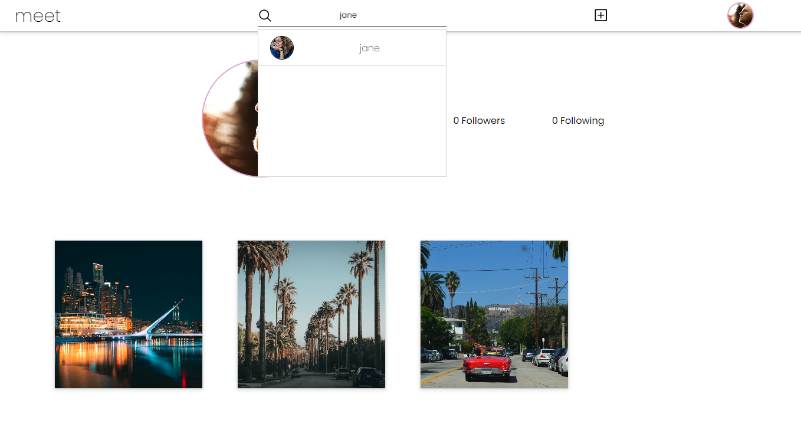

#
#

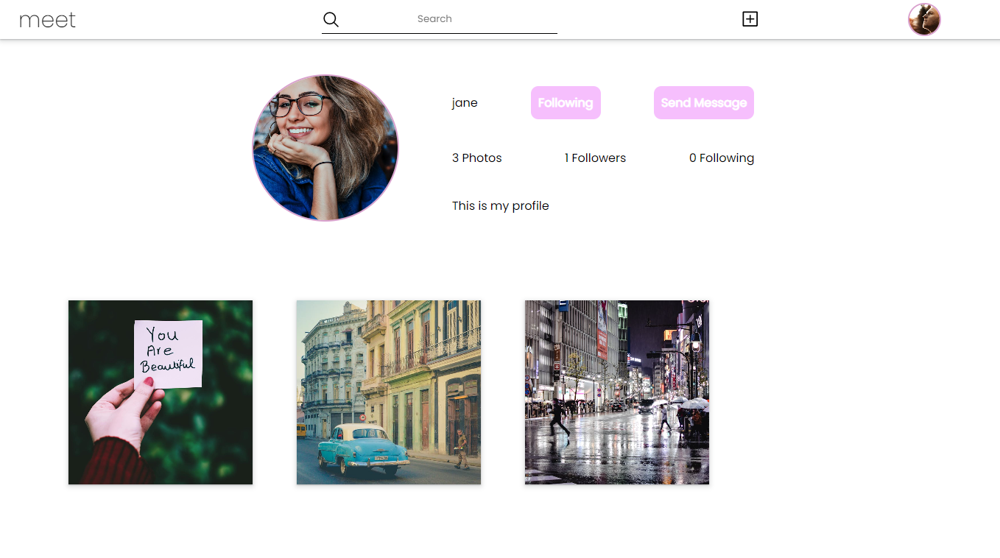

#
#

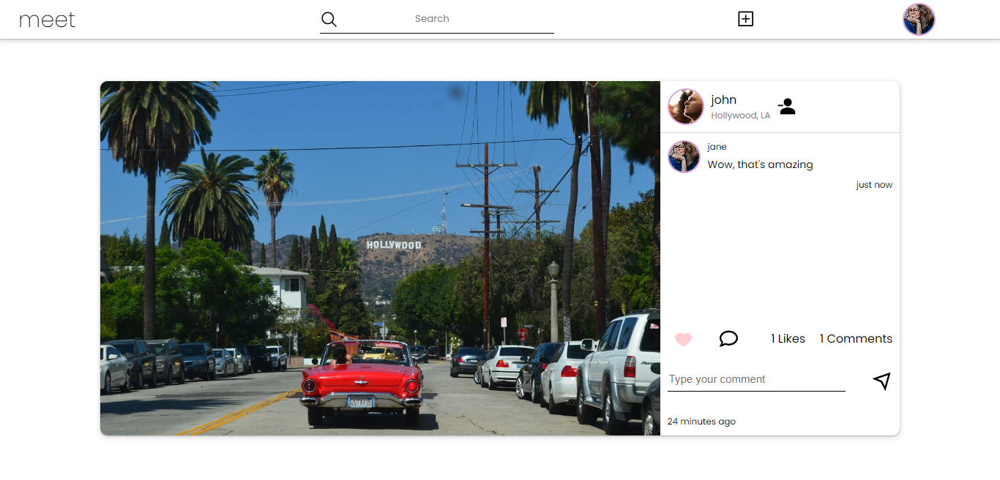

#
#

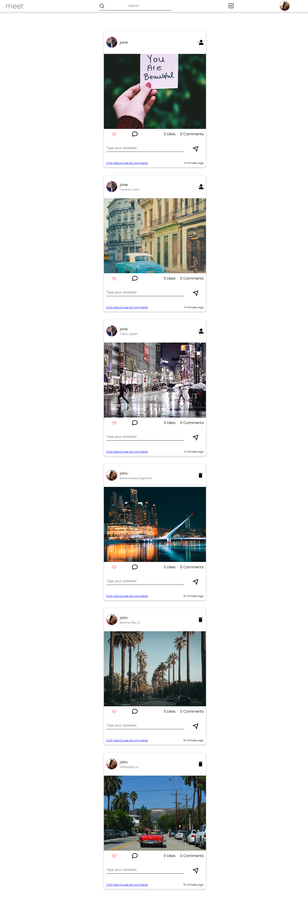

#
#


# Mobile View


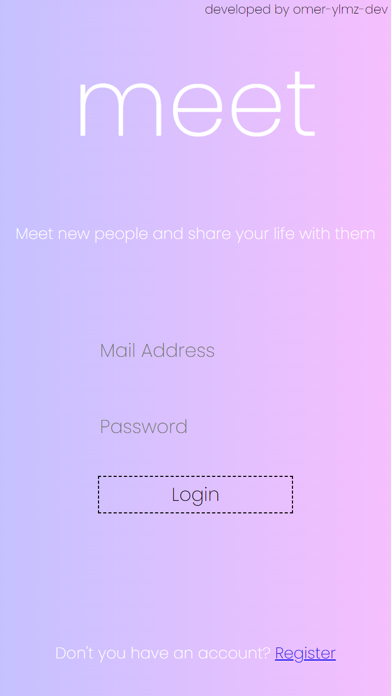

#
#

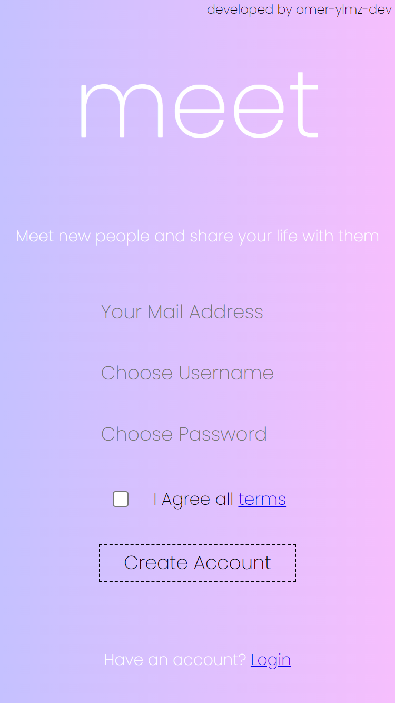

#
#


#
#

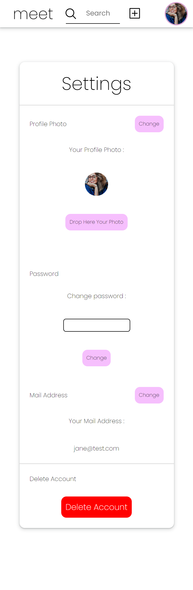

#
#

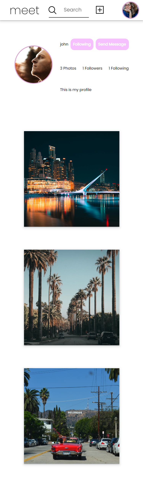

#
#

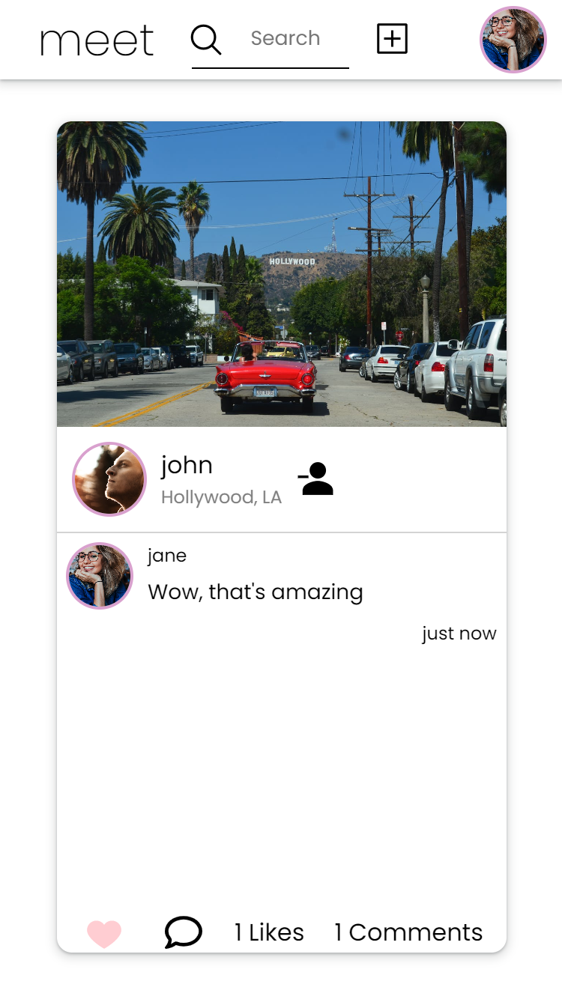

#
#


#
#


### Setup


for client

```
$ npm install
$ npm run build
$ npm run preview

```


for server


```

$ npm install
$ npm run start

```
